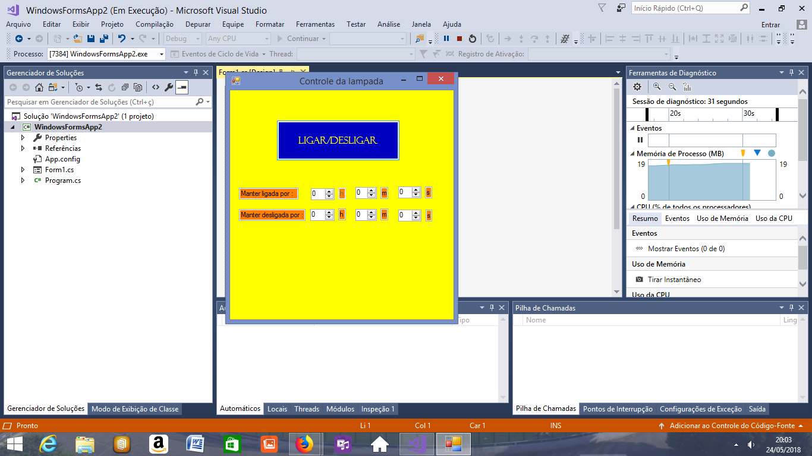

# mendes_controle-de-lampada

Conceito - controlar o acendimento e desligamento de uma lâmpada pelo computador
Motivação - automatizar o funcionamento da lâmpada, podendo o usuário programar horário para ligamento e desligamento

A biblioteca escolhida foi Windows forms, e executei o seguinte tutorial : https://msdn.microsoft.com/pt-br/library/dd492148.aspx

Esse tutorial ensina a fazer uma janela de visualizador de imagens, onde o usuário pode abrir uma imagem, apagar a mesma, escolher a cor do plano de fundo.

Esboço GUI:

A interface do programa de controle da lampada dá ao usuário a opção de ligar e desligar, além de poder detalhar o tempo em que deseja que a lampada permaneça no modo desejado. 

O programa ainda não está completo, pois ainda falta conseguir armazenar os dados do tempo e jogá-los para o arduino. O arquivo Lampada.cpp é o código utilizado no arduino. 
